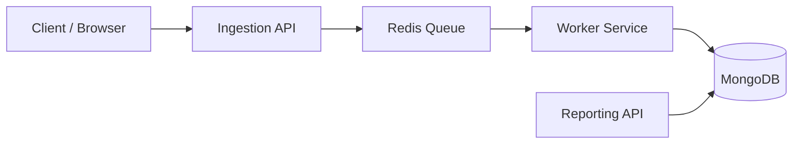

# 📊 Analytics Service 

A lightweight, production-style analytics backend that captures website events, processes them asynchronously through a Redis queue, stores them in MongoDB, and exposes reporting APIs for aggregated insights.

This project is fully dockerized and follows a clean microservice pattern using:
- **Node.js + Express**
- **Redis** (queue)
- **MongoDB**
- **Worker Service**
- **Docker Compose**

---


## 🚀 Features

### ✔ Ultra-fast Event Ingestion  
POST `/event`  
- Validates incoming analytics events  
- Pushes them to Redis queue  
- Returns instantly (`202 Accepted`)  
- No database writes on the request path  

### ✔ Background Worker  
- Continuously consumes events from Redis  
- Normalizes the record (adds `date` field)  
- Writes events to MongoDB  
- Ensures ingestion remains fast under high load  

### ✔ Reporting API  
GET `/stats?site_id=...`  
- Returns:
  - Total views  
  - Unique users  
  - Top visited paths  
- Optional `date=YYYY-MM-DD` filter  

### ✔ Fully Dockerized  
One command runs the entire system: `docker-compose up --build`


Why this pattern?
- Keep ingestion fast and stateless.
- Offload heavy I/O to workers to smooth spikes.
- Simple, robust, and easy to reason about in interviews and real projects.

---

##  Architecture Overview
Client → Ingestion API → Redis Queue → Worker → MongoDB ← Reporting API


Mermaid architecture diagram


---

## Tech Stack
| Component | Technology |
|---|---|
| Ingestion API | Node.js + Express|
| Queue | Redis  |
| Database | MongoDB  |
| Orchestration | Docker / Docker Compose (dev) |
| Worker Service | Node.js |
| Reporting API | Node.js + Express  |

---


## Folder structure 
```
.analytics-service/
    ├─ docker-compose.yml
    ├─ ingestion.js
    ├─ worker.js    
    ├─ reporting.js
    ├─ models/          
        |─ event.js        
    ├─ Dockerfile    
    ├─ package.json
    └─ README.md
```

---

## ⚙️ Getting Started
Install Required Tools

     Docker Desktop

     VS Code (recommended)


Start all services
```bash
docker-compose up --build
```
This starts:
| Service       | Port               |
| ------------- | ------------------ |
| Ingestion API | 3000               |
| Reporting API | 3001               |
| MongoDB       | 27017              |
| Redis         | 6379               |
| Worker        | background process |


Stop:
```bash
docker-compose down
```

---

## API Usage
1) Ingest Event
```bash
POST http://localhost:3000/event
```
Request Body:
```json
{
  "site_id": "site-abc",
  "event_type": "page_view",
  "path": "/home",
  "user_id": "user-123",
  "timestamp": "2025-11-14T10:00:00Z"
}
```
Powershell Example:
```powershell
Invoke-RestMethod -Uri "http://localhost:3000/event" -Method Post -Body '{"site_id":"site-abc","event_type":"page_view","path":"/home","user_id":"user-123","timestamp":"2025-11-14T10:00:00Z"}' -ContentType "application/json"

```
Response:
```json
{ "status": "accepted" }
```
2) Fetch Stats
URL:
```bash
GET http://localhost:3001/stats?site_id=site-abc
```
Optional Date Filter:
```bash
GET http://localhost:3001/stats?site_id=site-abc&date=2025-11-14

```
Example Response:
```json
{
  "site_id": "site-abc",
  "date": "2025-11-14",
  "total_views": 1450,
  "unique_users": 212,
  "top_paths": [
    { "path": "/pricing", "views": 700 },
    { "path": "/blog/post-1", "views": 500 },
    { "path": "/", "views": 250 }
  ]
}
```    
## MongoDB schema 
 Collection: `events`
 | Field      | Type   | Description                     |
| ---------- | ------ | ------------------------------- |
| site_id    | String | Website identifier              |
| event_type | String | Type of event (e.g., page_view) |
| path       | String | URL path                        |
| user_id    | String | User identifier                 |
| timestamp  | Date   | Original event timestamp        |
| date       | String | Derived YYYY-MM-DD              |


---

## 🌀 Why Redis Queue?
Redis ensures the system stays fast & stable:
- Ingestion API returns quickly
- Heavy write-load handled by worker
- Smooths traffic spikes
- Prevents API slowdowns
- Decouples ingestion and processing

---

## Future improvements 
 - Batch inserts in worker
- API key authentication
- Pre-aggregated daily metrics
- Basic dashboard UI (React)
- More detailed filters (start/end dates)


---
